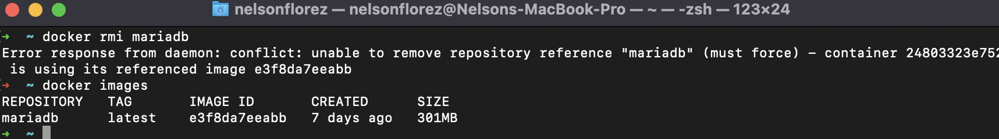

# Reto 2 - Docker - Trabajo con imágenes

1. Arrancar un contenedor que se llame bbdd y que ejecute una instancia de la imagen mariadb para que sea accesible desde el puerto 3306. Establecer variables de entorno

###### Solucion

---
 

2. Pantallazo de la conexión al servidor de base de datos con el usuario creado y de la base de datos prueba creada automáticamente.

###### Solucion

 

---
 

3. Pantallazo donde se comprueba que no se puede borrar la imagen mariadb mientras el contenedor bbdd está creado.

###### Solucion

---
 
