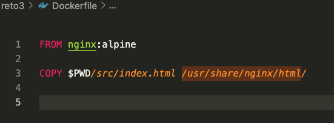

# Reto 3 - Docker - Trabajo con imágenes

1. Crear el fichero Dockerfile. 

###### Nota: se realizo un script que automatiza los pasos

###### Solucion

---
 

2. Crear un volumen 'static_content' 

###### Solucion

---
 

3. Construir la imagen del contenedor. El nombre de la imagen es 'bootcamp_nginx' 

###### Solucion

---
 

4. Crear el contenedor con nombre 'bootcamp_container' utilizando la imagen construida en el paso 3

###### Solucion

---
 

5. Comprobar que aparece la pagina deseada

###### Solucion

---
 

# 6.Deploy to Registry DockerHub

###### Solucion

---
 

