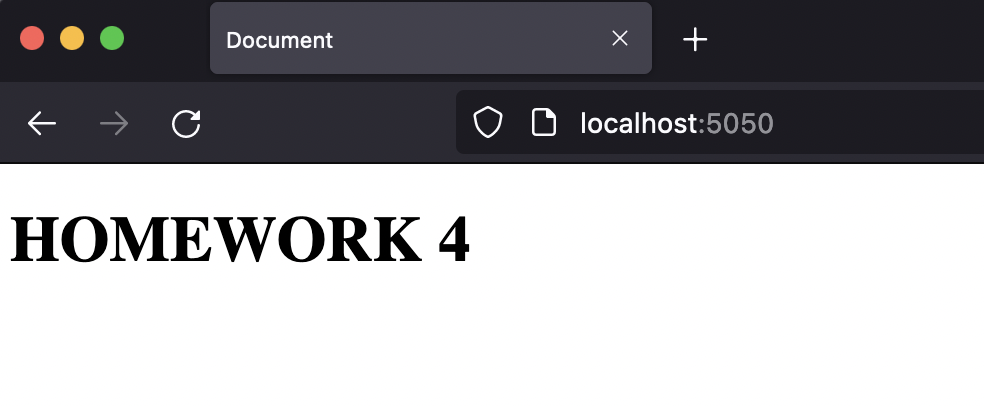

# Reto 4 - Ejercicio 1 - Crear imagen de Apache

1. Crea una imagen con un servidor web Apache y el mismo contenido que en la carpeta content.

###### Solucion

---
 

2. Ejercicio 2 - Crear contenedor desde la nueva imagen

###### Solucion

---
 

3.  Inspeccionar la imagen

###### Solucion

---
 

