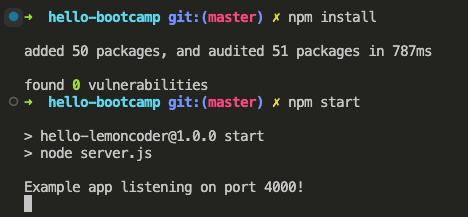
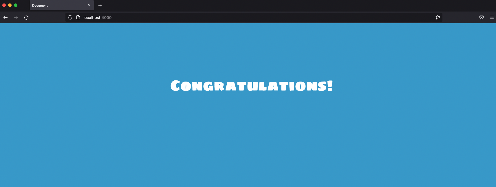
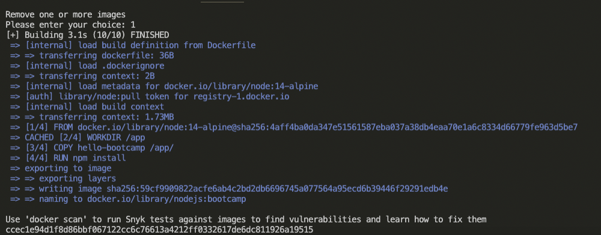
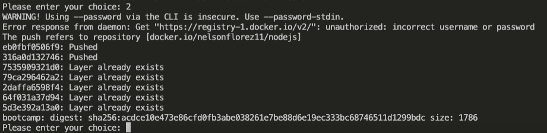
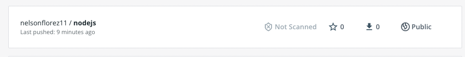
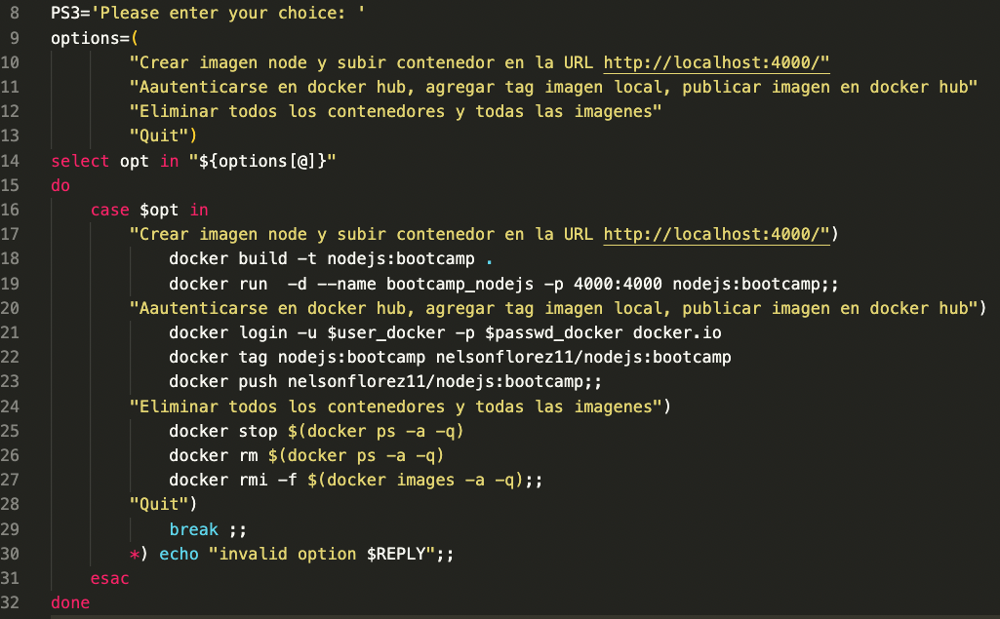
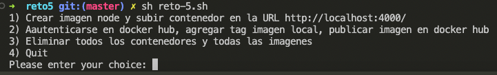

# Reto 5 - Containerizar aplicacion Node.js

###### Nota: se realizo un script que automatiza los pasos

1. Dockeriza la carpeta hello-bootcamp Antes de hacerlo ¡pruébala en local! Genera la imagen con el VS Code

###### Prueba local

 

---
 

2. Ejecuta un contenedor con la imagen

###### Solucion

---
 

3.  Subir la aplicacion en registry

###### Solucion

 

4. Crear el Script que permita realizar todo lo antes mencionado

 

