# Reto 5 - Ejercicio 1 - Crear contenedor de MongoDB, MongoDB Express

###### Nota: se realizo un script que automatiza los pasos

1. Crea un contenedor con MongoDB, protegido por usuario y contraseña. Conectate utilizando Mongo Compass. Crea una base de datos llamada Library con una colección llamada Books.

###### Solucion
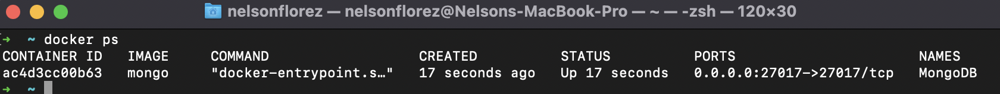
 

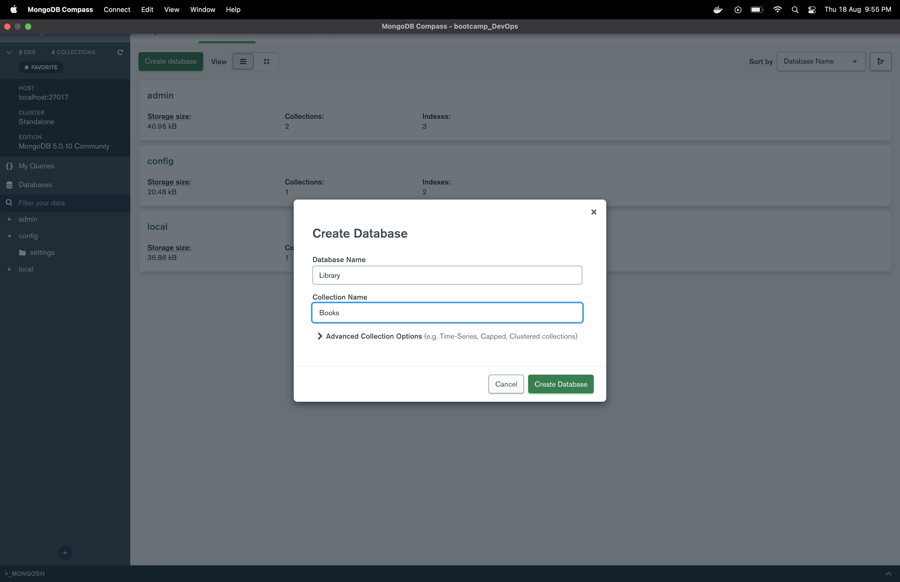
 

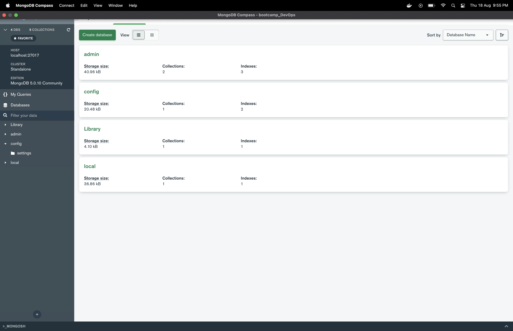
 

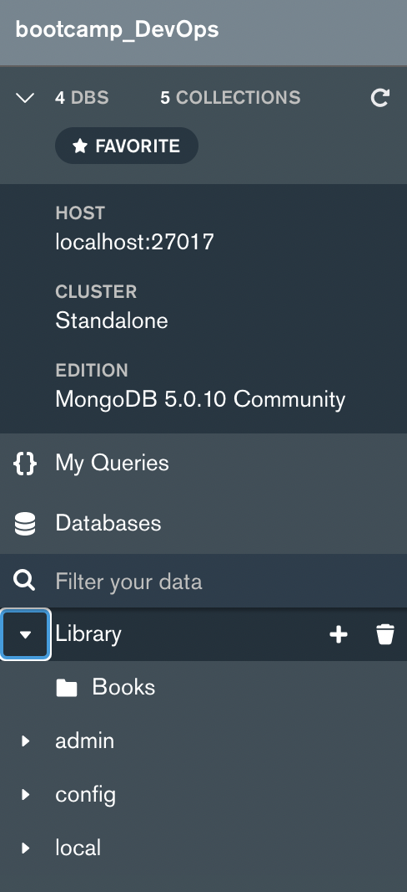
 

 

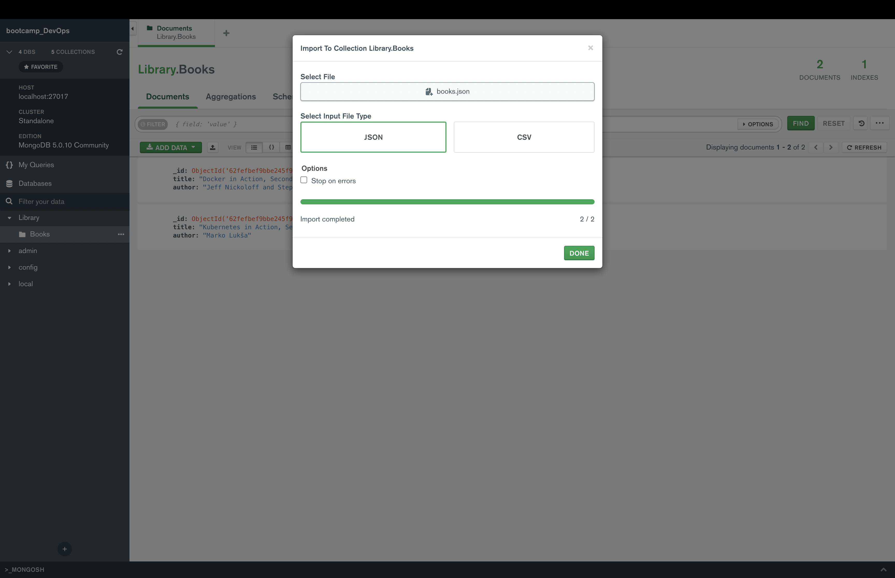
 

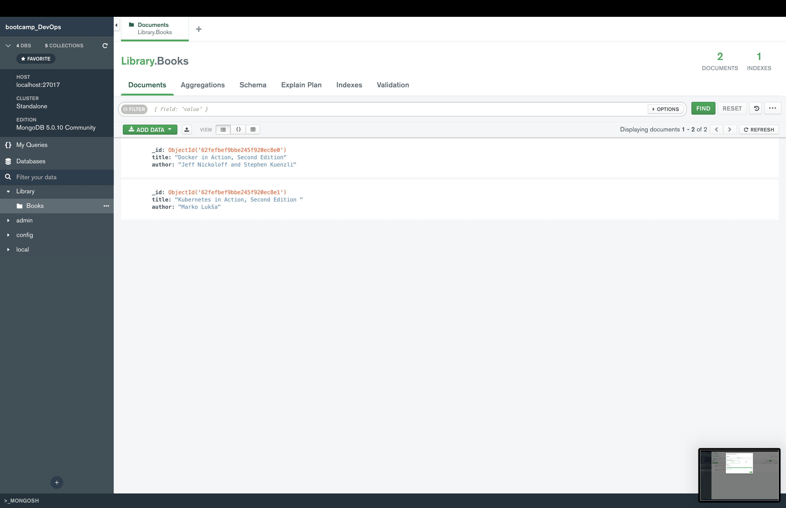
 

---
 

2. Crea un contenedor llamado bootcamp-web, con Nginx, accesible desde http://localhost:9999. Copia el contenido de la carpeta bootcamp-web de la unidad en la ruta que sirve este servidor. Ejecuta ls desde fuera para ver que el contenido se ha copiado correctamente.Accede a través del navegador de tu máquina.

###### Solucion

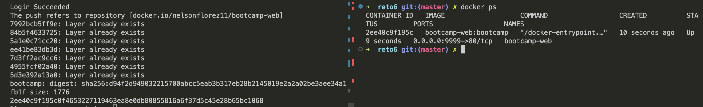

 

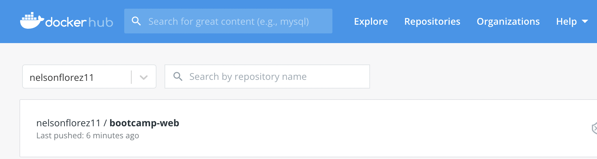

 

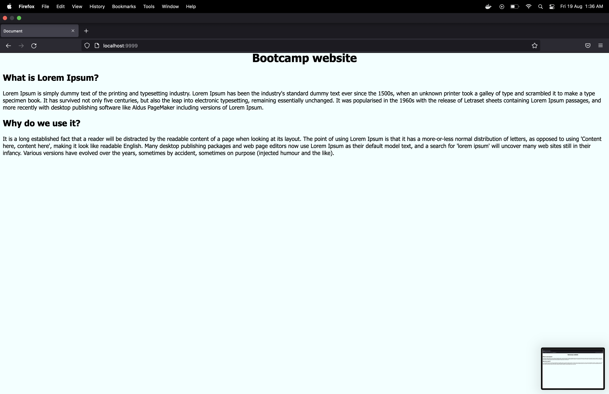

 

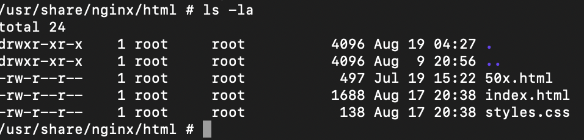

 

3.  Eliminar todos los contenedores que tienes ejecutándose en tu máquina. 

###### Solucion

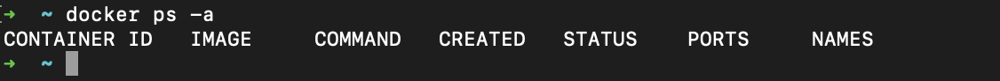
 

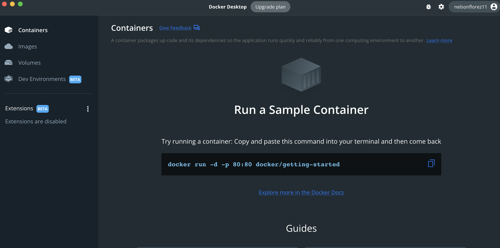

---

