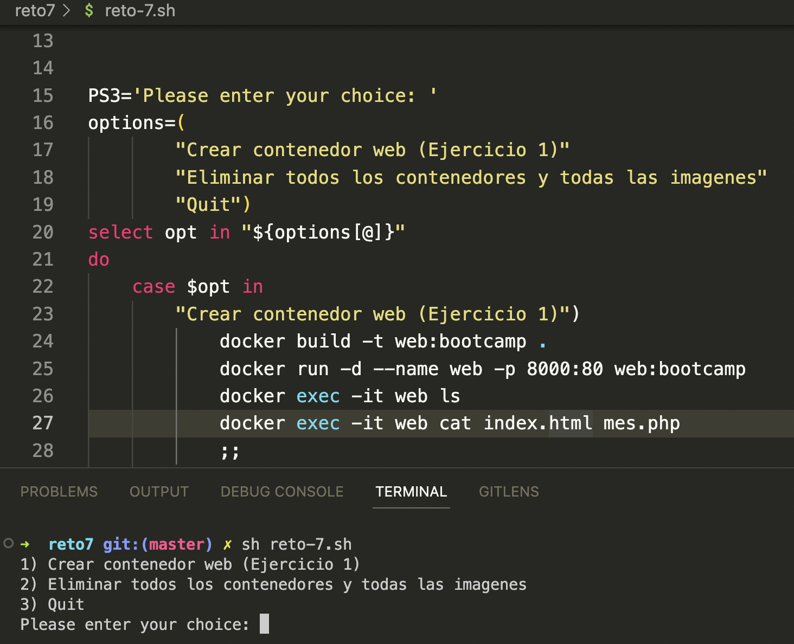
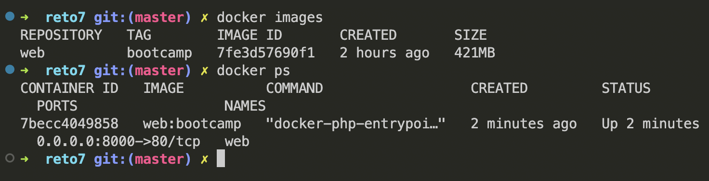
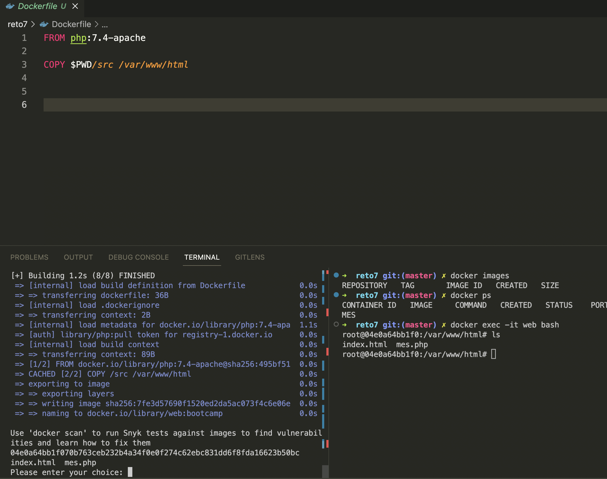
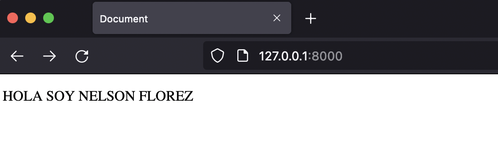
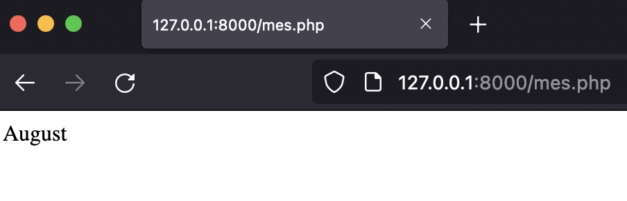
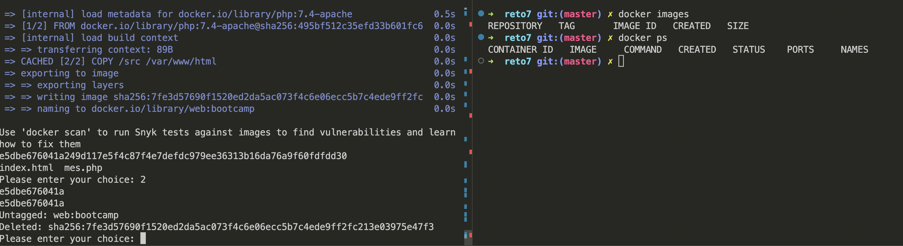

# Reto 7 - Servidor web

###### Nota: se realizo un script que automatiza los pasos

1. Arrancar un contenedor que ejecute la imagen php:7.4-apache, llamado web, por el puerto 8000.

###### Solucion

 

 
---

2. Colocar en el directorio raíz del contenedor un archivo index.html que contenga 'HOLA SOY XXXXX' (nombre y apellidos).

###### Solucion

 
---

3.  Colocar en el mismo directorio otro archivo llamado llamado mes.php que muestre el mes actual, y ver la salida del script en el navegador. 

###### Solucion

 

---

4. Borrar el contenedor.

