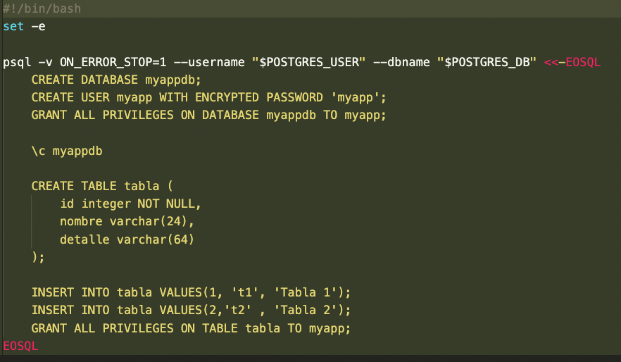
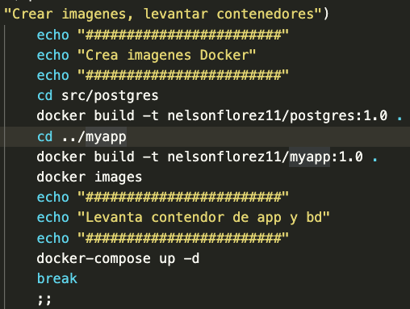
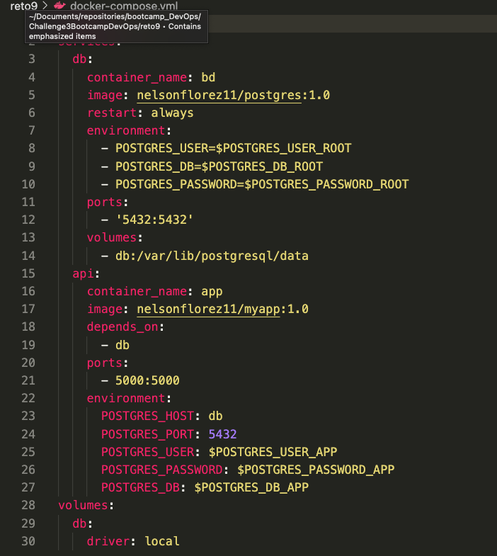
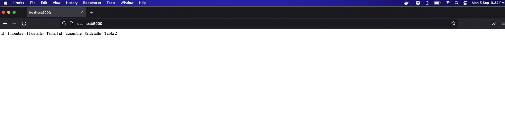

# Reto 9 - Proyecto en Python Flask

###### Nota: se realizo un script que automatiza los pasos

Hay 1 aplicacion en este proyecto:

1. La aplicacion se compone de un Backend en el que se conecta a una base de datos Relacional "Postgress"
2. El Desafio es crear el docker-compose.yaml para desplegar la aplicacion
3. Tomen en cuenta que primero deben contruir antes de desplegar
4. Tanto el Backend y la BD cuenta con un Dockerfile, revisenlo si le hace falta mejorarlo

###### Solucion de los puntos anteriores

1. Se realizaron modificaciones en el script  init-db.sh, se crea contraseña y se asignan privilegios al usuario de la app sobre la tabla (Esto para fines academicos, nunca exponga sus contraseñas en ambientes productivos)

 
---

3. Se crean imagenes docker con su respectivo Dockerfile

 
---

2. Se crea archivo docker compose que levanta los contenedores de la bd y la app y los contecta entre si para que el servicio se exponga en la siguiente URL http://localhost:5000/ 

 
---

 
---
